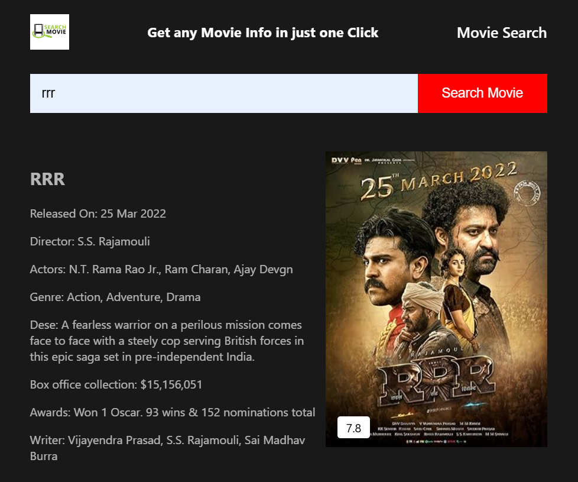

# 🎬 Movie Search App  
A fast and responsive movie search application built by **Gaurav Kolhe**, using **HTML, CSS, and JavaScript**.  
It uses a public movie API to fetch details like **movie titles, posters, release year, and more** all in real time.

---

---

## 🔴 Live Demo  
👉 **Try the app here:**  
https://mrgaurav77.github.io/MovieSearch/

---

## 🚀 Features
- 🔍 Search any movie instantly  
- 🖼️ Displays movie poster, title, year & overview  
- ⚡ Fast API calls with JavaScript  
- 📱 Fully responsive UI  
- 🎨 Clean and minimal design  

---

## 🛠️ Tech Stack
- **HTML** – Page structure  
- **CSS** – Styling & layout  
- **JavaScript** – API handling & dynamic rendering  
- **OMDB API** 

---
